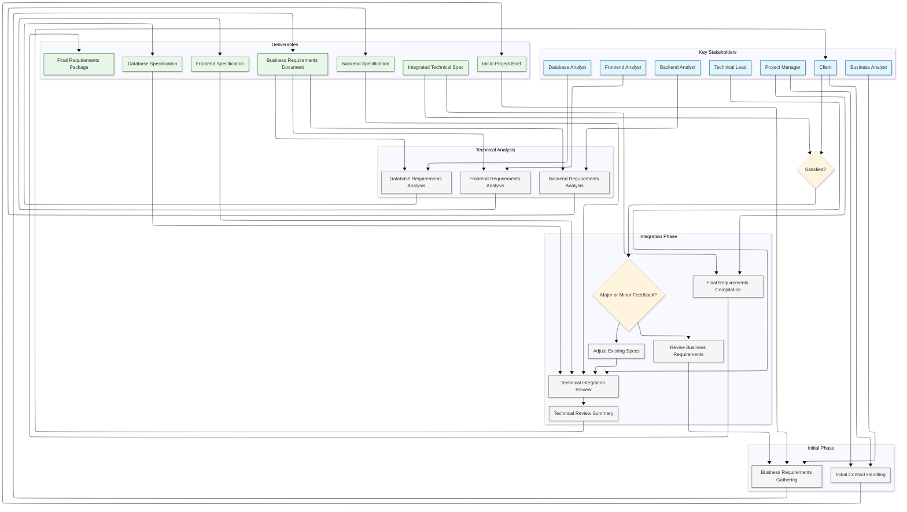

# Delopr

Requirements Workflow

```mermaid
---
config:
  theme: base
  look: neo
  layout: elk
---
flowchart TB
 subgraph Agents["Key Stakeholders"]
        PM["Project Manager"]
        BA["Business Analyst"]
        FA["Frontend Analyst"]
        BEA["Backend Analyst"]
        DA["Database Analyst"]
        TL["Technical Lead"]
        Client["Client"]
  end
 subgraph Initial_Phase["Initial Phase"]
        T1["Initial Contact Handling"]
        T2["Business Requirements Gathering"]
  end
 subgraph Technical_Analysis["Technical Analysis"]
    direction TB
        T3["Frontend Requirements Analysis"]
        T4["Backend Requirements Analysis"]
        T5["Database Requirements Analysis"]
  end
 subgraph Integration_Phase["Integration Phase"]
        T6["Technical Integration Review"]
        Summary["Technical Review Summary"]
        Decision{"Major or Minor Feedback?"}
        Minor["Adjust Existing Specs"]
        Major["Revise Business Requirements"]
        T7["Final Requirements Compilation"]
  end
 subgraph Outputs["Deliverables"]
        O1["Initial Project Brief"]
        O2["Business Requirements Document"]
        O3["Frontend Specification"]
        O4["Backend Specification"]
        O5["Database Specification"]
        O6["Integrated Technical Spec"]
        O7["Final Requirements Package"]
  end
    Client --> T1 & ClientSatisfaction{"Satisfied?"}
    PM --> T1 & T7
    T1 --> O1
    O1 --> T2
    BA --> T2
    T2 --> O2
    O2 --> T3 & T4 & T5
    FA --> T3
    BEA --> T4
    DA --> T5
    T3 --> O3
    T4 --> O4
    T5 --> O5
    O3 --> T6
    O4 --> T6
    O5 --> T6
    TL --> T6
    T6 --> Summary
    Summary --> Client
    Decision --> Minor & Major
    Minor --> T6
    Major --> T2
    O6 --> T7 & ClientSatisfaction
    T7 --> O7
    ClientSatisfaction --> Decision
     PM:::agent
     BA:::agent
     FA:::agent
     BEA:::agent
     DA:::agent
     TL:::agent
     Client:::agent
     T1:::task
     T2:::task
     T3:::task
     T4:::task
     T5:::task
     T6:::task
     Summary:::task
     Minor:::task
     Major:::task
     T7:::task
     O1:::output
     O2:::output
     O3:::output
     O4:::output
     O5:::output
     O6:::output
     O7:::output
    classDef agent fill:#e1f5fe,stroke:#01579b
    classDef task fill:#f5f5f5,stroke:#616161
    classDef output fill:#e8f5e9,stroke:#2e7d32

```
